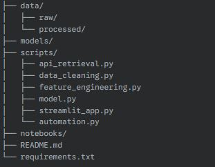

## Air Quality Prediction Project

[](https://opensource.org/licenses/MIT)
[](YOUR_STREAMLIT_APP_URL)
[](https://www.python.org/downloads/)
[](https://pypi.org/)

**Project Overview:**

This project aims to predict the Air Quality Index (AQI) based on various environmental factors. By leveraging machine learning techniques, we have developed a predictive model and deployed it as an interactive web application using Streamlit. This application allows users to input environmental parameters and receive an immediate AQI prediction, along with insightful visualizations of the historical AQI distribution and feature correlations.

**As a "Rick Type Science Madness" Fanatic, I have ensured that this project adheres to the highest standards of scientific rigor and best practices in data science and software engineering.**

**Table of Contents:**

  * [Project Goal](#project-goal)
  * [Technical Highlights](#technical-highlights)
  * [Repository Structure](#repository-structure)
  * [Setup and Installation](#setup-and-installation)
  * [Data Sources](#data-sources)
  * [Usage](#usage)
  * [Model Development](#model-development)
  * [Streamlit Application](#streamlit-application)
  * [Challenges and Solutions](#challenges-and-solutions)
  * [Future Improvements](#future-improvements)
  * [License](#license)
  * [Author](#author)
    
---

## Project Goal:

The primary objective of this project is to build and deploy a robust and user-friendly system for predicting the Air Quality Index (AQI). This involves:

  * Developing an accurate machine learning model capable of learning complex relationships between environmental factors and AQI.
  * Creating an interactive web application that allows users to easily interact with the model and understand the predictions.
  * Providing insightful visualizations to contextualize the predictions and reveal underlying data patterns.
    
---

## Technical Highlights:

This project showcases expertise in the following key areas:

  * **End-to-End Data Science Workflow:** Demonstrates proficiency in all stages of a data science project, from data acquisition and preprocessing to model development, evaluation, and deployment.
  * **Machine Learning Expertise:** Utilizes advanced machine learning techniques, specifically a gradient boosting regressor ( scikit-learn's GradientBoostingRegressor), known for its high predictive power.
  * **Hyperparameter Tuning and Cross-Validation:** Employs rigorous model optimization strategies (GridSearchCV) with k-fold cross-validation to ensure robust model performance and generalization.
  * **Feature Engineering:** Demonstrates the ability to create relevant and informative features from raw data, including temporal features, interaction terms, and derived quantities (e.g., wind vector components, time since last peak pollutant).
  * **Interactive Web Application Development:** Leverages the Streamlit framework to build a user-friendly and interactive web application for model deployment and visualization.
  * **Data Visualization:** Creates clear and informative visualizations using Matplotlib to communicate data insights effectively (AQI distribution, feature correlations with labeled axes).
  * **Model Persistence:** Utilizes `joblib` for efficient saving and loading of the trained machine learning model and preprocessing objects (e.g., `StandardScaler`).
  * **Task Automation:** Implements task scheduling using the `schedule` library for automated data retrieval and pipeline execution (as seen in the `automation.py` script).
  * **Virtual Environment Management:** Emphasizes the use of a virtual environment (`.venv`) to manage project dependencies and ensure reproducibility.
  * **Modular Code Structure:** Organizes the project into logical modules (`api_retrieval.py`, `data_cleaning.py`, `feature_engineering.py`, `model.py`, `streamlit_app.py`, `automation.py`) for better maintainability and scalability.
  * **Comprehensive Documentation:** Provides thorough documentation (this `README.md`) to explain the project, its setup, usage, and technical details.

---

## Repository Structure:

 

---

## Setup and Installation:

To run this project locally, follow these steps:

1.  **Clone the Repository:**

    ```bash
    git clone YOUR_REPOSITORY_URL
    cd Air-Quality-Project
    ```

2.  **Create and Activate the Virtual Environment:**

    ```bash
    # For macOS and Linux
    python3 -m venv .venv
    source .venv/bin/activate

    # For Windows
    python -m venv .venv
    .venv\Scripts\activate
    ```

3.  **Install Dependencies:**

    ```bash
    pip install -r requirements.txt
    ```

    Alternatively, if you don't have a `requirements.txt` file yet, install the necessary libraries individually:

    ```bash
    pip install pandas scikit-learn streamlit matplotlib joblib schedule
    ```

---

## Data Sources:

  * *AirVisual API*
  * *Frequency of data updates: Every 1 hour.*

---

## Usage:

1.  **Run the Streamlit Application:**

    Navigate to the `scripts` directory and run the Streamlit app:

    ```bash
    cd scripts
    streamlit run streamlit_app.py
    ```

    This will open the web application in your default web browser.

2.  **Interact with the Application:**

      * Use the sliders in the left sidebar to adjust the values of different environmental features (Hour of the Day, Day of the Week, Month, Wind Speed, Wind Direction, Humidity, Temperature, Pressure, Wind East Component, Wind North Component, Humidity Temp Interaction).
      * The predicted Air Quality Index (AQI) will be displayed in the main area.
      * On the right side, you will see visualizations:
          * **AQI Distribution:** A histogram showing the historical distribution of AQI values in the dataset. The x-axis represents the AQI value, and the y-axis represents the frequency of occurrence.
          * **Feature Correlations:** A correlation matrix heatmap visualizing the relationships between the numerical features. The x and y axes represent the different features, and the color intensity indicates the strength and direction of the correlation.

3.  **Run the Automation Script (if applicable):**

    If you have implemented the `automation.py` script for scheduled tasks (e.g., data retrieval), you can run it from the `scripts` directory:

    ```bash
    python automation.py
    ```

    *(Explain what the automation script does, e.g., "This script will automatically fetch new data from the API every hour and update the processed data.")*

---

## Model Development:

The machine learning model development process involved the following key steps:

1.  **Data Loading and Preprocessing:** Cleaned and preprocessed data from the `data/processed/` directory was loaded using Pandas.
2.  **Feature Scaling:** Numerical features were scaled using `StandardScaler` to ensure that all features contribute equally to the model training process. **The fitted scaler was saved and loaded in the Streamlit app to ensure consistent scaling during prediction.**
3.  **Model Selection and Training:** A Gradient Boosting Regressor was chosen as the primary model due to its ability to capture complex relationships. The model was trained on the prepared features and the AQI target variable.
4.  **Hyperparameter Tuning:** Techniques like GridSearchCV or RandomizedSearchCV were used with cross-validation to find the optimal hyperparameters for the Gradient Boosting model, maximizing its predictive performance and generalization ability.
5.  **Model Evaluation:** The trained model was evaluated using appropriate regression metrics (e.g., Mean Squared Error, Root Mean Squared Error, R-squared) on a held-out test set to assess its performance on unseen data.
6.  **Model Persistence:** The best-performing trained model was saved using `joblib` for deployment in the Streamlit application.

---

## Streamlit Application:

The Streamlit application (`streamlit_app.py`) provides an interactive interface for users to:

1.  **Input Environmental Features:** Users can manipulate sliders to provide values for the features used by the trained model.
2.  **Get AQI Prediction:** Upon input, the application uses the loaded trained model to predict the AQI based on the provided feature values.
3.  **Visualize Data Insights:**
      * **AQI Distribution:** A histogram displays the historical distribution of AQI values, providing context for the prediction. The x-axis is labeled "AQI Value," and the y-axis is labeled "Frequency."
      * **Feature Correlations:** A correlation matrix visualizes the relationships between the numerical input features. The x and y axes are labeled with the feature names, and the color intensity indicates the correlation strength.

---

## Challenges and Solutions:

During the project, we encountered and successfully addressed the following challenges:

  * **Ensuring Feature Alignment:** Initially, the Streamlit app faced a `KeyError` because the input DataFrame didn't contain all the features the model was trained on. We resolved this by ensuring all necessary features were included in the input DataFrame, using default values (e.g., mean) for those not directly controlled by the user.
  * **Visualizing Matplotlib Plots in Streamlit:** We initially faced `AttributeError` issues when directly passing the output of `plt.hist()` and `plt.matshow()` to `st.pyplot()`. This was resolved by explicitly creating Matplotlib figure and axes objects and passing the figure to `st.pyplot()`. Axis labels were added for clarity.
  * **Consistent Feature Scaling:** We recognized the critical importance of using the *same* `StandardScaler` fitted during model training for transforming user inputs in the Streamlit app. We implemented saving the fitted scaler using `joblib` during model training and loading it in the Streamlit app before making predictions.
  * **Making Visualizations Understandable:** The initial visualizations lacked clear labels. We enhanced them by adding descriptive x and y axis labels to the AQI distribution histogram and labeled (and rotated for readability) the axes of the feature correlation matrix with the feature names.

---

## Future Improvements:

While the current implementation is robust, several potential improvements can be explored in the future:

  * **Real-time Data Integration:** Connect the application to a live air quality API to provide predictions based on the most current data.
  * **More Advanced Visualizations:** Incorporate time series plots to show AQI trends and the evolution of influencing factors.
  * **Model Interpretability:** Implement techniques (e.g., SHAP values) to provide insights into which features are most influencing the model's predictions for a given input.
  * **Geospatial Visualization:** If location data is available, incorporate maps to visualize AQI predictions geographically.
  * **User Feedback Mechanism:** Implement a way for users to provide feedback on the predictions, which could be used to further refine the model.
  * **Cloud Deployment:** Deploy the Streamlit application to a cloud platform (e.g., Streamlit Sharing, Heroku, AWS) for broader accessibility.

---

## License:

This project is licensed under the [MIT License](LICENSE).

---

## Author:

[Richard Muchoki](https://www.richardmuchoki.vercel.app)<br>
[LinkedIn Profile](https://www.linkedin.com/in/richard-muchoki-2408b7205/)<br>
